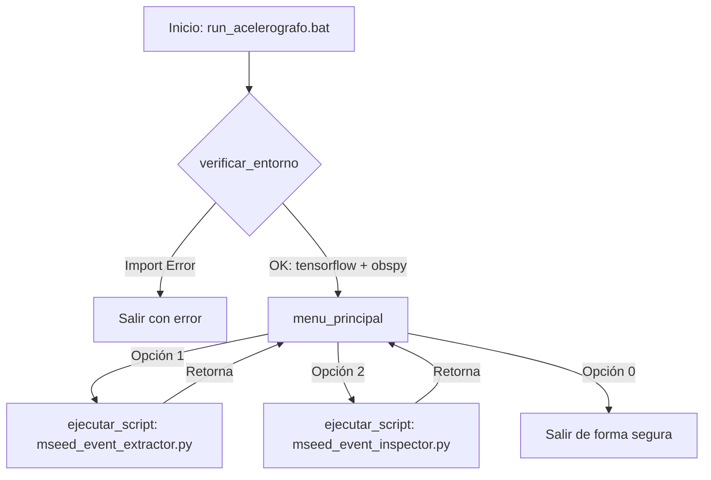

# main.py — Contexto para Agentes IA

> Menú interactivo basado en terminal para la selección y ejecución de scripts de análisis sismológico dentro del entorno virtual.

**Ruta**: `src/acelerografos/main.py`  
**LOC**: 72 | **Lenguaje**: Python | **Dependencias**: `sys`, `os`, `subprocess`  
**Proceso**: Se ejecuta de forma automatizada mediante el lanzador por lotes `bin/run_acelerografo.bat` o directamente con `python src/acelerografos/main.py` dentro del entorno virtual `rsa_acelerografo`.

---

## Arquitectura

El script sirve como un orquestador que valida primero el entorno científico importando `tensorflow` y `obspy`. Si la validación es correcta, levanta un bucle interactivo que lee entradas de consola del usuario. Al elegir una opción, ejecuta el script correspondiente en un subproceso para garantizar el aislamiento de memoria.

---

## Configuraciones / Variables de Envío

No depende de variables de entorno externas ni configuraciones de puertos. Utiliza `sys.executable` para invocar dinámicamente el mismo intérprete activo del subproceso padre, eliminando la necesidad de re-activar el entorno de Micromamba.

---

## Componentes / Funciones / Servicios Clave

| Elemento | Descripción |
|----------|-------------|
| `verificar_entorno()` | Importa de forma dinámica `tensorflow` y `obspy` e imprime sus versiones para certificar que el entorno virtual no está corrupto. |
| `ejecutar_script(nombre_script)` | Localiza el script en base a la ruta del archivo activo y levanta un subproceso con `subprocess.run` aislando su ejecución. |
| `menu_principal()` | Bucle interactivo `while True` que presenta en consola las opciones de análisis disponibles y lee la entrada de teclado. |

---

## Limitaciones Conocidas / TODOs

- Requiere que los scripts a ejecutar convivan en el mismo directorio físico (`src/acelerografos/`).
- La entrada es interactiva y sincrónica; la terminal queda bloqueada hasta que finalice el script ejecutado.
