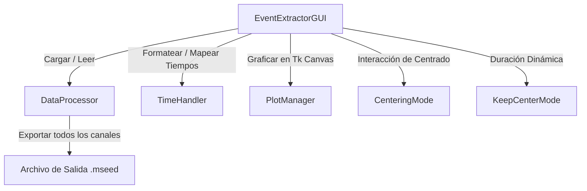

# mseed_event_extractor.py — Contexto para Agentes IA

> Interfaz gráfica interactiva que permite a los analistas visualizar trazas sísmicas a partir de un archivo miniSEED y extraer/exportar sub-segmentos de eventos de forma precisa y unificada.

**Ruta**: `src/acelerografos/mseed_event_extractor.py`  
**LOC**: 677 | **Lenguaje**: Python | **Dependencias**: `tkinter`, `obspy`, `matplotlib`, `numpy`  
**Proceso**: Invocado mediante `main.py` o de manera independiente a través de `python src/acelerografos/mseed_event_extractor.py` con el entorno `rsa_acelerografo` activo.

---

## Arquitectura

El script sigue el patrón de diseño clásico de interfaces de escritorio dividiendo el control en clases de soporte independientes para datos, tiempo y UI.

---

## Configuraciones / Variables de Entorno

- **`PROJECT_LOCAL_ROOT`** *(Opcional)*: Define la raíz por defecto para abrir los cuadros de diálogo de archivos. Si no se encuentra en las variables de entorno locales, el código lo infiere automáticamente resolviendo tres niveles hacia arriba de su ubicación física en el disco.

---

## Componentes / Funciones / Servicios Clave

| Clase / Elemento | Descripción |
|------------------|-------------|
| `TimeHandler` | Contiene utilidades estáticas para lidiar con el formato sismológico de milisegundos (`%H:%M:%S,ms`) y convertir a objetos `UTCDateTime` de ObsPy. |
| `DataProcessor` | Maneja las operaciones de lectura de archivos con `read()`, remuestreo dinámico a 100 Hz y recorte multi-canal (`trim`/`slice`). |
| `PlotManager` | Incrusta una figura interactiva de Matplotlib dentro del contenedor de Tkinter, vinculando eventos de mouse para coordenadas y clicks. |
| `KeepCenterMode` | Permite cambiar la duración de la ventana de análisis (ej. de 10s a 30s) manteniendo exactamente el mismo punto medio/centro de la señal. |
| `EventExtractorGUI` | Clase principal que maqueta la interfaz, gestiona menús dinámicos de canales e implementa el guardado multi-canal. |

---

## Limitaciones Conocidas / TODOs

- El remuestreo del stream en visualización está fijo a 100 Hz (`stream.resample(100.0)`).
- La exportación de datos numéricos discrimina entre tipos de enteros (`STEIM2`) y flotantes (`FLOAT32`) en base al tipo de datos detectado en el bloque sismológico para evitar pérdidas de resolución.
