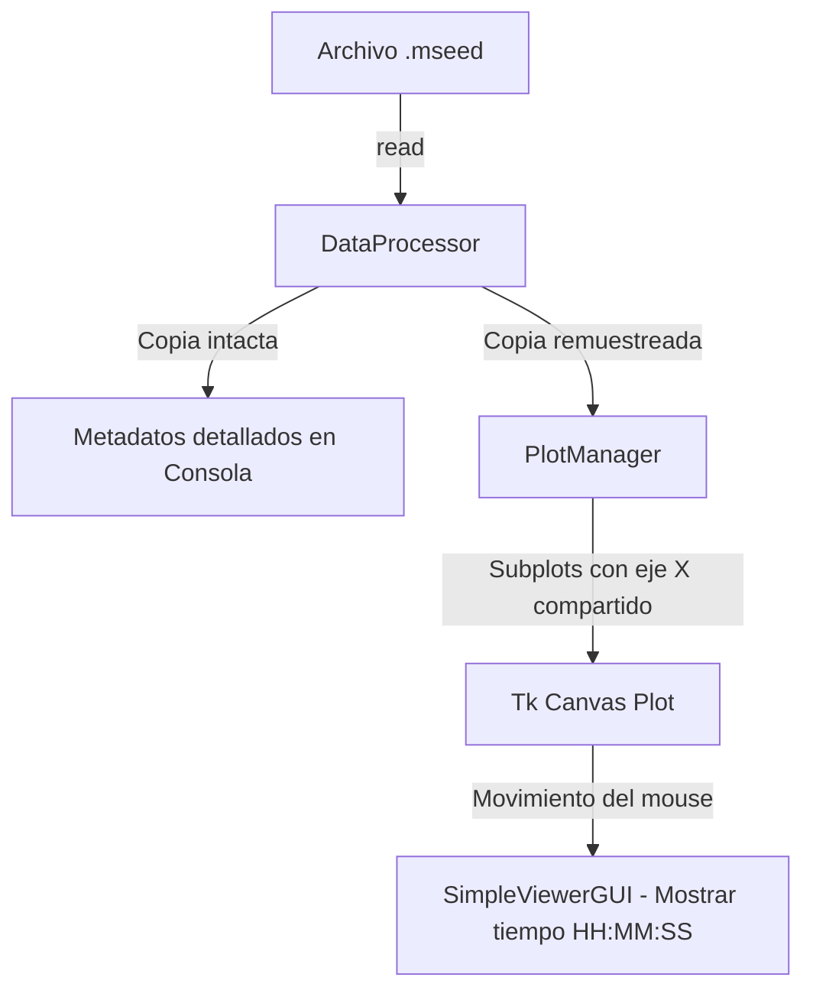

# mseed_event_inspector.py — Contexto para Agentes IA

> Interfaz gráfica simple orientada al diagnóstico y visualización de archivos miniSEED, imprimiendo estadísticas y metadatos de trazas sísmicas de forma detallada.

**Ruta**: `src/acelerografos/mseed_event_inspector.py`  
**LOC**: 403 | **Lenguaje**: Python | **Dependencias**: `tkinter`, `obspy`, `matplotlib`  
**Proceso**: Invocado por `main.py` o directamente con `python src/acelerografos/mseed_event_inspector.py` dentro del entorno virtual.

---

## Arquitectura

El inspector lee el archivo miniSEED y clona el stream original. Conserva una versión original intacta para analizar y reportar metadatos numéricos detallados en consola, mientras que realiza un sub-muestreo a 100 Hz sobre una copia secundaria dedicada de forma exclusiva a renderizarse en la interfaz visual.

---

## Configuraciones / Variables de Entorno

- **`PROJECT_LOCAL_ROOT`** *(Opcional)*: Ruta por defecto para diálogos de carga. Si no se provee en un archivo `.env`, se calcula dinámicamente apuntando a la raíz del repositorio local de análisis.

---

## Componentes / Funciones / Servicios Clave

| Clase / Elemento | Descripción |
|------------------|-------------|
| `TimeHandler` | Formatea los objetos de fecha y hora agregando precisión de milisegundos (`%H:%M:%S.ms`). |
| `DataProcessor` | Carga el archivo miniSEED, calcula la duración total, extrae las estadísticas numéricas (mínimo, máximo, media, desviación estándar) de los canales e imprime la metadata detallada en la consola estándar. |
| `PlotManager` | Distribuye dinámicamente las trazas del archivo miniSEED en múltiples paneles (subplots) con un eje X temporal compartido en formato de horas del día. |
| `SimpleViewerGUI` | Orquesta la interfaz, los cuadros de selección de archivos y la interactividad para mostrar la posición de tiempo al mover el puntero del mouse sobre las ondas. |

---

## Limitaciones Conocidas / TODOs

- La escala del eje X temporal en los gráficos se dibuja siempre en unidades de horas del día (porcentaje de 24 horas), lo que puede requerir adaptación para archivos miniSEED que cruzan la frontera de medianoche o contienen rangos de días múltiples.
